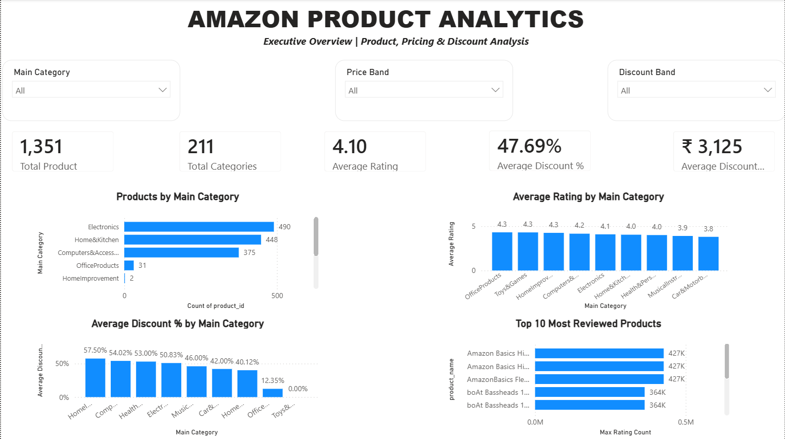
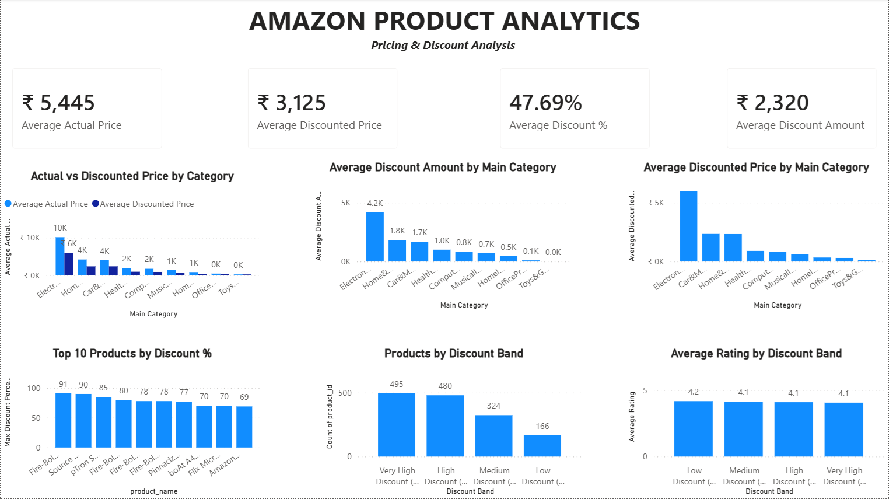
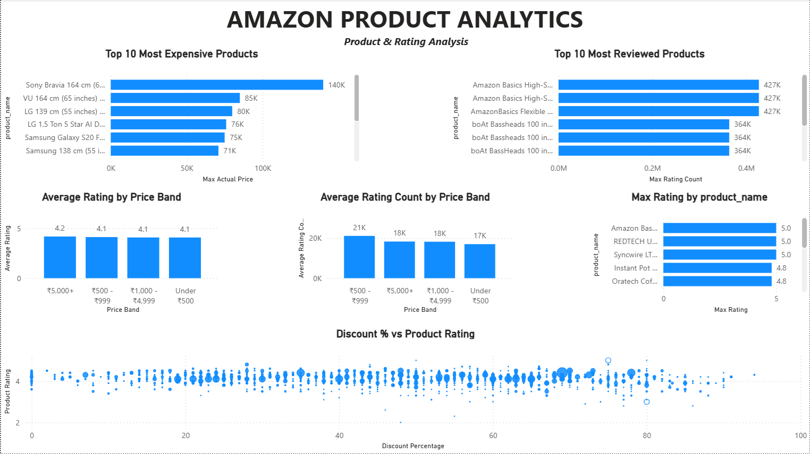
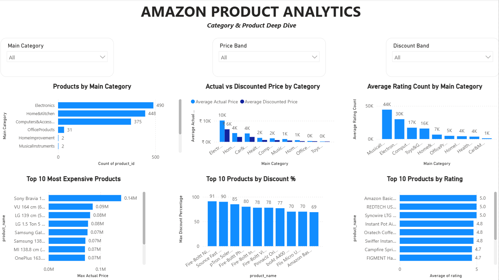
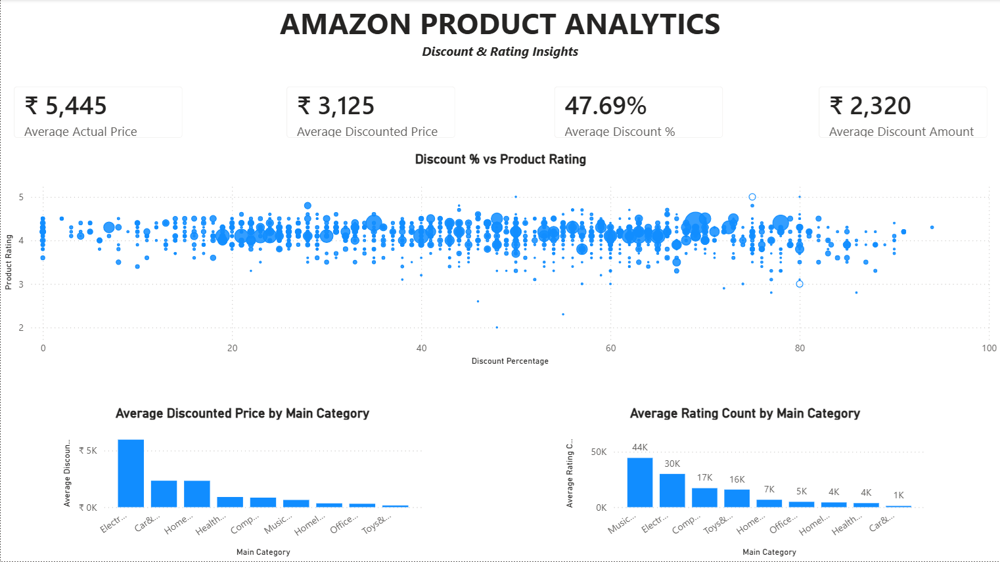
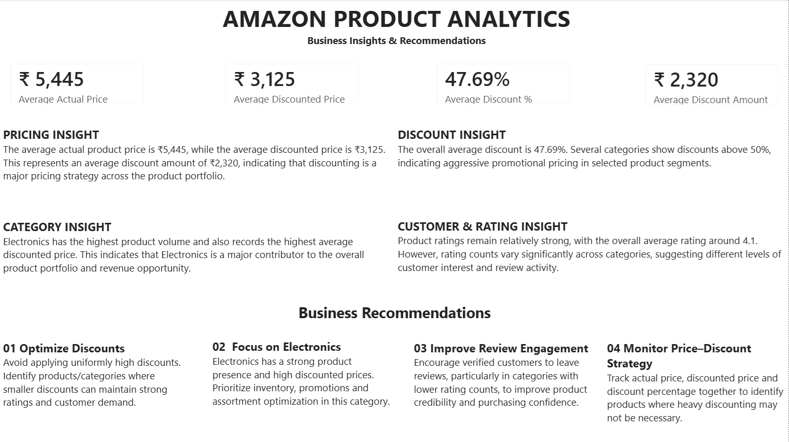

# 📊 Amazon Product Analytics – Power BI

## 📌 Project Overview

This project analyzes Amazon product data using Microsoft Power BI to understand product categories, pricing, discount strategies, product ratings, and customer engagement.

The dashboard provides an interactive view of product performance and helps identify pricing patterns, discount opportunities, category-level trends, and customer review activity.

The analysis covers **1,351 products across 211 categories** and includes interactive analysis using Main Category, Price Band, and Discount Band filters.

---

## 🎯 Business Objective

The objective of this project is to analyze Amazon product data and answer key business questions related to:

- Product category distribution
- Product pricing
- Discount strategies
- Product ratings
- Customer review engagement
- Category-level performance
- Price and discount relationships

The analysis converts product-level data into meaningful business insights and recommendations.

---

## 🛠️ Tools & Technologies

- **Microsoft Power BI** – Dashboard development and visualization
- **Power Query** – Data cleaning and transformation
- **DAX** – Analytical calculations and KPIs
- **Excel / CSV** – Source data
- **Data Visualization** – Business reporting and analysis

---

## 📈 Key KPIs

| KPI | Value |
|---|---:|
| Total Products | 1,351 |
| Total Categories | 211 |
| Average Rating | 4.10 |
| Average Actual Price | ₹5,445 |
| Average Discounted Price | ₹3,125 |
| Average Discount | 47.69% |
| Average Discount Amount | ₹2,320 |

---

## 📊 Dashboard Preview

### 1. Amazon Product Overview



### 2. Pricing & Discount Analysis



### 3. Product & Rating Analysis



### 4. Category & Product Deep Dive



### 5. Discount & Rating Insights



### 6. Business Insights & Recommendations



---

## 🔍 Key Business Insights

### 💰 Pricing & Discount

- The average actual product price is **₹5,445**.
- The average discounted price is **₹3,125**.
- The average discount is **47.69%**.
- The average discount amount is approximately **₹2,320**.
- Several categories show average discounts above 50%, indicating aggressive promotional pricing in selected segments.

### 📦 Category Performance

- **Electronics** has the highest product volume with **490 products**.
- **Home & Kitchen** follows with **448 products**.
- **Computers & Accessories** has **375 products**.
- Electronics also records the highest average discounted price among the major categories.

### ⭐ Rating & Customer Engagement

- Overall average product rating is **4.10**.
- Product ratings remain relatively strong across categories.
- Rating engagement varies significantly between categories.
- Some products receive exceptionally high numbers of ratings, indicating strong customer engagement and product visibility.

### 📉 Discount & Rating Relationship

The analysis compares discount percentage with product ratings to understand whether higher discounts are associated with stronger product ratings.

The relationship appears varied across products rather than showing a simple direct pattern, suggesting that discounting alone does not determine customer ratings.

---

## 💡 Business Recommendations

### 01. Optimize Discounts

Avoid applying uniformly high discounts.

Identify products and categories where smaller discounts can maintain strong ratings and customer demand while protecting pricing value.

### 02. Focus on Electronics

Electronics has a strong product presence and high discounted prices.

Prioritize inventory, promotions, and assortment optimization in this category.

### 03. Improve Review Engagement

Encourage verified customers to leave reviews, particularly in categories with lower rating counts.

Higher review engagement can improve product credibility and purchasing confidence.

### 04. Monitor Price–Discount Strategy

Track actual price, discounted price, and discount percentage together to identify products where heavy discounting may not be necessary.

---

## 📂 Project Structure

```text
amazon-product-analytics-powerbi/
│
├── Amazon_Product_Analytics.pbix
├── README.md
│
└── Screenshots/
    ├── 01-amazon-product-overview.png
    ├── 02-pricing-discount-analysis.png
    ├── 03-product-rating-analysis.png
    ├── 04-category-product-deep-dive.png
    ├── 05-discount-rating-insights.png
    └── 06-business-insights-recommendations.png
